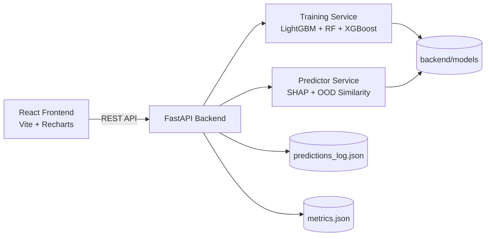

# BankLoan-AI

An end-to-end **AI loan risk assessment platform** built with **FastAPI + React**.
It predicts approval outcomes, explains predictions with SHAP, and provides analytics for model quality and fairness.

## Why this project is portfolio-worthy

- Full-stack implementation: data → model training → API → interactive UI
- Real ML workflow: upload data, train/retrain, score, explain, monitor
- Decision transparency: SHAP explanation + fairness/approval analytics
- Production-minded behavior: health check, CORS config, prediction logging controls

## Core capabilities

- Upload and validate loan training data (`.csv`)
- Train an ensemble model (**LightGBM + RandomForest + XGBoost**)
- Real-time prediction with outcomes:
  - `APPROVE`
  - `REJECT`
  - `MANUAL_REVIEW`
- SHAP feature impact explanations per prediction
- Analytics dashboard:
  - model performance
  - feature importance
  - fairness by age bucket
  - approval distribution

## High-level architecture



## Tech stack

- **Frontend:** React, Vite, Tailwind CSS, Recharts, Axios
- **Backend:** FastAPI, Uvicorn, Pydantic
- **ML/Data:** scikit-learn, LightGBM, XGBoost, SHAP, pandas, NumPy, imbalanced-learn

## Project structure

```text
Bank_loan/
├── backend/
│   ├── main.py
│   ├── requirements.txt
│   ├── routers/
│   ├── services/
│   ├── data/
│   └── models/
├── frontend/
│   ├── src/
│   ├── package.json
│   └── vite.config.js
└── README.md
```

## Quick start (local)

### 1) Backend (FastAPI)

```bash
cd backend
python3 -m venv .venv
source .venv/bin/activate
pip install -r requirements.txt
python -m uvicorn main:app --reload --host 0.0.0.0 --port 8000
```

Backend URLs:

- API root: `http://localhost:8000/`
- Swagger UI: `http://localhost:8000/docs`
- Health: `http://localhost:8000/health`

### 2) Frontend (React + Vite)

```bash
cd frontend
npm install
npm run dev
```

Frontend URL:

- `http://localhost:5173`

## Environment configuration

| Variable            | Where                       | Default                                       | Purpose               |
| ------------------- | --------------------------- | --------------------------------------------- | --------------------- |
| `VITE_API_BASE_URL` | `frontend/.env`             | `http://localhost:8000/api`                   | Frontend API base URL |
| `ALLOWED_ORIGINS`   | backend shell / backend env | `http://localhost:5173,http://127.0.0.1:5173` | CORS allowed origins  |

Example:

```env
VITE_API_BASE_URL=http://localhost:8000/api
ALLOWED_ORIGINS=http://localhost:5173,http://127.0.0.1:5173
```

## Deploy: Frontend on Vercel + Backend on Render

This repository is configured for split deployment:

- **Frontend:** Vercel
- **Backend:** Render

### 1) Deploy backend on Render

Use the included `render.yaml` (Blueprint) or configure manually:

- Service type: Web Service (Python)
- Root directory: `backend`
- Build command: `python -m pip install --upgrade pip && python -m pip install -r requirements.txt`
- Start command: `uvicorn main:app --host 0.0.0.0 --port $PORT`
- Health check path: `/health`

Set backend env var:

- `ALLOWED_ORIGINS=https://<your-vercel-domain>.vercel.app`

After deploy, note your backend URL, for example:

- `https://bankloan-ai-backend.onrender.com`

### 2) Deploy frontend on Vercel

Use this repo and configure:

- Root Directory: `frontend`

Set frontend env var in Vercel:

- `VITE_API_BASE_URL=https://<your-render-backend>.onrender.com/api`

Deploy and verify:

- Frontend loads from Vercel URL
- Frontend API calls go to Render `/api/...`

### 3) If backend deploy fails (`No module named uvicorn`)

If Render logs show:

- `Done in 0.03s` during build
- `/usr/bin/python: No module named uvicorn` during start

then service/runtime settings are likely wrong.

Fix in Render dashboard:

1. Ensure service **Environment = Python**
2. Ensure **Root Directory = backend**
3. Set Build/Start commands exactly as above
4. Clear build cache and redeploy latest commit

## Typical workflow

1. Start backend + frontend
2. Upload dataset (optional if model artifacts already exist)
3. Train or retrain model (`/api/train`)
4. Run predictions from `/predict`
5. Review explanations + analytics dashboards

## API quick reference

| Method | Endpoint                               | Description                     |
| ------ | -------------------------------------- | ------------------------------- |
| `POST` | `/api/upload`                          | Upload training CSV             |
| `POST` | `/api/train`                           | Train/retrain model artifacts   |
| `GET`  | `/api/train/status`                    | Model training state + metrics  |
| `POST` | `/api/predict`                         | Predict decision + score + SHAP |
| `GET`  | `/api/analytics/model-performance`     | AUC/F1/confusion matrix         |
| `GET`  | `/api/analytics/feature-importance`    | Top model features              |
| `GET`  | `/api/analytics/fairness`              | Approval rate by age groups     |
| `GET`  | `/api/analytics/approval-distribution` | APPROVE/REJECT/REVIEW split     |

> Note: `/api/predict` supports `?track=false` for non-persistent preview scoring.

## Example prediction payload

```json
{
  "age": 35,
  "MonthlyIncome": 4500,
  "DebtRatio": 0.32,
  "RevolvingUtilizationOfUnsecuredLines": 0.28,
  "NumberOfOpenCreditLinesAndLoans": 8,
  "NumberOfDependents": 2,
  "NumberRealEstateLoansOrLines": 1,
  "NumberOfTime30_59DaysPastDueNotWorse": 0,
  "NumberOfTime60_89DaysPastDueNotWorse": 0,
  "NumberOfTimes90DaysLate": 0
}
```

## Decisioning logic snapshot

- Risk score formula: `risk_score = int(300 + approval_probability * 600)`
- Outcome rules:
  - `APPROVE` if approval probability is high and profile similarity is acceptable
  - `REJECT` if approval probability is low
  - Otherwise `MANUAL_REVIEW`

## Current model metrics (from `backend/models/metrics.json`)

- Test AUC: **0.8364**
- Gini: **0.6728**
- Precision: **0.1381**
- Recall: **0.8693**
- F1 Score: **0.2383**

## Deployment readiness checklist

- ✅ Health endpoint (`/health`) for readiness checks
- ✅ Configurable CORS via `ALLOWED_ORIGINS`
- ✅ Frontend API URL override via `VITE_API_BASE_URL`
- ✅ Prediction preview calls can skip analytics logging (`track=false`)

## Troubleshooting

### `No module named 'joblib'`

Use your backend virtual environment and reinstall dependencies:

```bash
cd backend
source .venv/bin/activate
pip install -r requirements.txt
```

### CORS blocked in browser

Set backend `ALLOWED_ORIGINS` to include your frontend URL.

### Model not ready / prediction unavailable

Train first via UI or `POST /api/train`.

## Notes

- Training data expected at: `backend/data/cs-training.csv`
- Model artifacts: `backend/models/`
- Metrics file: `backend/models/metrics.json`
- Prediction logs: `backend/models/predictions_log.json`

---

Maintained by **Kumaraswamy**.
